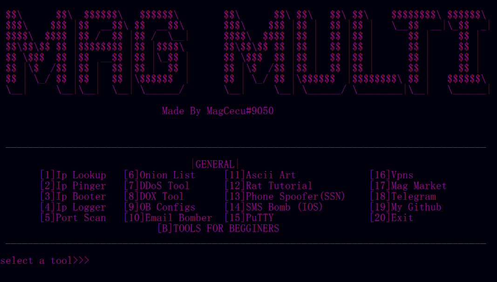

# MagMultitoolV3

  

This is the third version of the MagMultitool made by the long gone HSCC....

# Old version                                                           
https://github.com/magcecu/Mag-Multitool-V-1.2

# Inside
This rep contains:                                                                            
Folder with some of the premade programs                                                                              
Main program                                                                                                    
Instructions                                                                                                                 
Requirements                                                                                                                             

# Device
Works only on win and linux

# Support
Paypal:                                                                                                                           
https://www.paypal.me/ivanedavai                                                                                                 
Discord Surver:                                                                                                                   
https://discord.gg/sGwvPYk3

# Made By mag cecu
